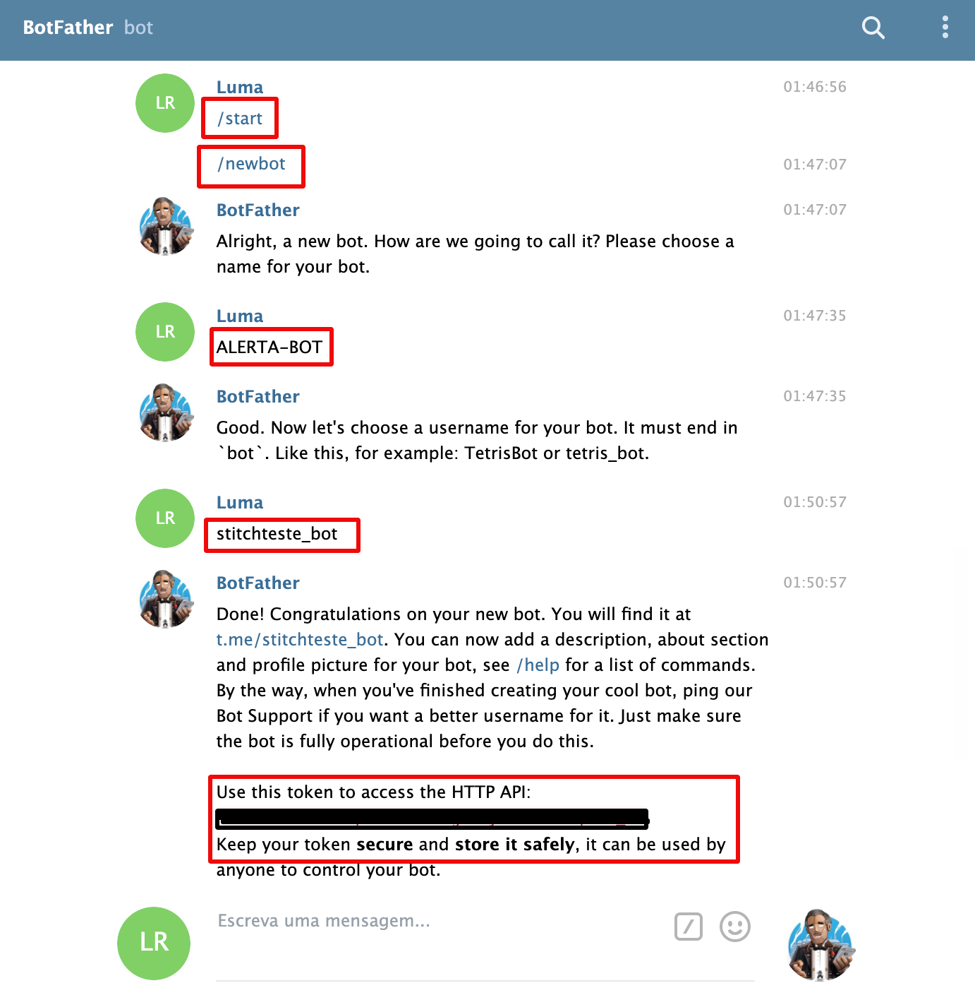

## Integração Prometheus + Telegram

### Alertmanager-bot

É o bot Alertmanager para Prometheus que avisa sobre alertas. Basta configurar o AlertManager para enviar Webhooks para o bot. Além disso, com o Alertmanager-bot você sempre pode enviar comandos para obter informações atualizadas do gerenciador de alertas.

#### Pré-requisito

No Telegram, criar um @BotFather como o exemplo a seguir: 

<p align="center">
  
</p>


#### Docker compose

Incluir o conteiner do alertmanager-bot no docker-compose.yaml: 

```
  alertmanager-bot:
    image: metalmatze/alertmanager-bot:0.4.0
    container_name: alertmanager-bot
    depends_on:
    - alertmanager
    environment:
      LISTEN_ADDR: 0.0.0.0:8081
      ALERTMANAGER_URL: http://alertmanager:9093
      BOLT_PATH: /data/bot.db
      STORE: bolt
      TELEGRAM_ADMIN: '1234567'
      TELEGRAM_TOKEN: TokenGeradoPeloBotFather
      TEMPLATE_PATHS: /templates/default.tmpl
    ports:
    - 8081:8081
    volumes:
    - alertmanager-bot-volume:/data
volumes:
  alertmanager-bot-volume:
```

### Alertmanager

Alterar alertmanager.yml e inclir o webhook_configs: 

```
  webhook_configs:
  - send_resolved: true
    url: 'http://alertmanager-bot:8081'
```

### Executar

```
$ docker-compose up 
```
 
Depois execute o seguinte comando:

```
$ docker logs -f alertmanager-bot
```

E em paralelo abra o chat do Bot e execute /start, deve aparecer uma mensagem de erro com um send_id

Copie o **sender_id** para a variavel **TELEGRAM_ADMIN** no docker-compose.yaml.

```
  alertmanager-bot:
    environment:    
      TELEGRAM_ADMIN: 'xxxxxx' #colocar o sender_id
```

Em seguida reinicie novamente o alertmanager-bot:

```
$ docker-compose up
```

Volte ao chat do Bot e tente novamente o comando /start
